# Phase 0-A 验证结果（2026-06-10，最终版）

> 计划文档：[docs/agent/](../../docs/agent/README.md) ｜ 代码：[hfagent/](../README.md) ｜ 原始输出：[`hfagent/out/`](../out/)

## 结论一句话

**色块图路线走得通，不切 Plan B。** 最终管线（two-pass 生成 + 正交化 parser + JSON 空间确定性数量修复）在 5 个 program（6~26 间房）上**数量全部精确**；几何合法率 100%。核心哲学——LLM 出结构、确定性代码裁决（LLM-Modulo）——被实测反复证实，且实测表明把"精确性"从像素空间挪到结构空间是收敛的关键。

## 最终管线（与早期版本的差异见下文沿革）

```
program(JSON) ──▶ ① Gemini 画真实建筑平面（带房型标注）       [pass 1]
                  ② Gemini 转无门窗色块图（按标签上色去文字）   [pass 2]
                  ③ cv_parse：正交多边形 + 全图墙线对齐         [确定性]
                  ④ 数量校验：不对→反馈编辑 pass-1，≤3轮取最优  [验证器循环]
                  ⑤ fix_room_counts：重贴标签/合并/分割 兜底    [确定性，零API]
```

配置开关在 [`config.json`](../config.json)（`pipeline: direct | two-pass`、纠错轮数上限）；测试输入在 [`programs.json`](../programs.json)。

## 实验设置

- 文本模型 `gemini-3.1-pro-preview`、图像模型 `gemini-3-pro-image`（Nano Banana Pro）——由 `models.list()` 实时自动解析，零硬编码（[`llm.py`](../llm.py)）。
- 三个 tool：[`generate_colorblock`](../tools/generate_colorblock.py) / [`cv_parse`](../tools/cv_parse.py) / [`render_plan`](../tools/render_plan.py)，共享同一色板 [`palette.py`](../schema/palette.py)。
- pytest 8 项（含 round-trip 门禁）；3 个手写 program，多轮 sweep 共 ~13 次真实图像生成。

---

## 第一层：round-trip 闭环（无 VLM 噪声，parser 自证）

合成 Plan → `render_plan` → `cv_parse` → 与原 Plan 对比。**8/8 通过**：逐房间 IoU≥0.85、min IoU≥0.75、房间数全对、类型 100%。

| 确定性渲染（输入） | parse 后重渲染（输出） |
|---|---|
| 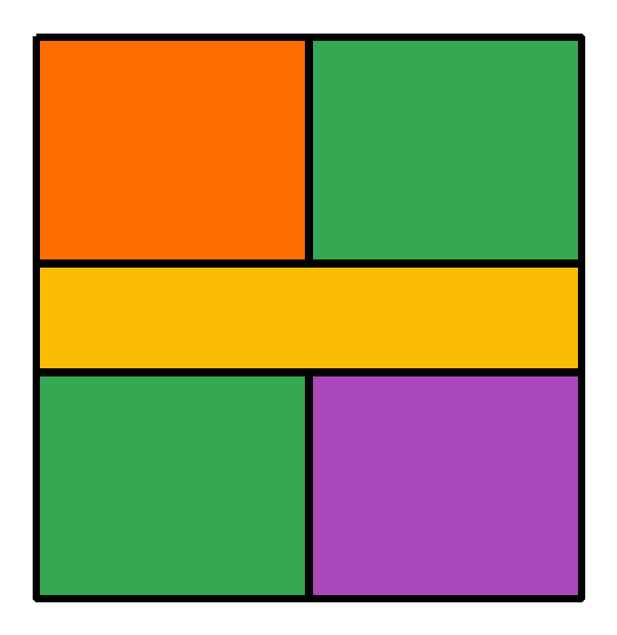 | 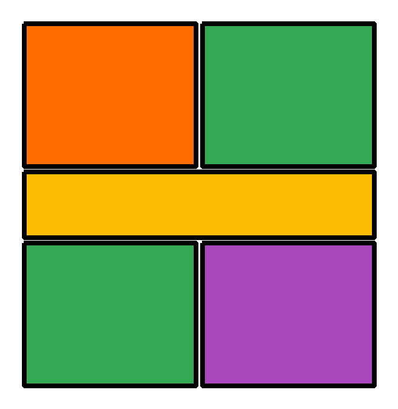 |
|  |  |

L 形房间（非矩形）也能正确穿过整个环。**parser 由此可信**——后续真图上的所有差距都可归因于 VLM。

---

## 第二层：真实 VLM 评测

### ✅ 几何质量：好（13/13 张全部可解析）

Gemini 出的图正交、墙线干净、风格遵循好。parser 忠实还原：

| Gemini 原图（ward-wing 第一轮 sweep） | cv_parse → 重渲染 |
|---|---|
| 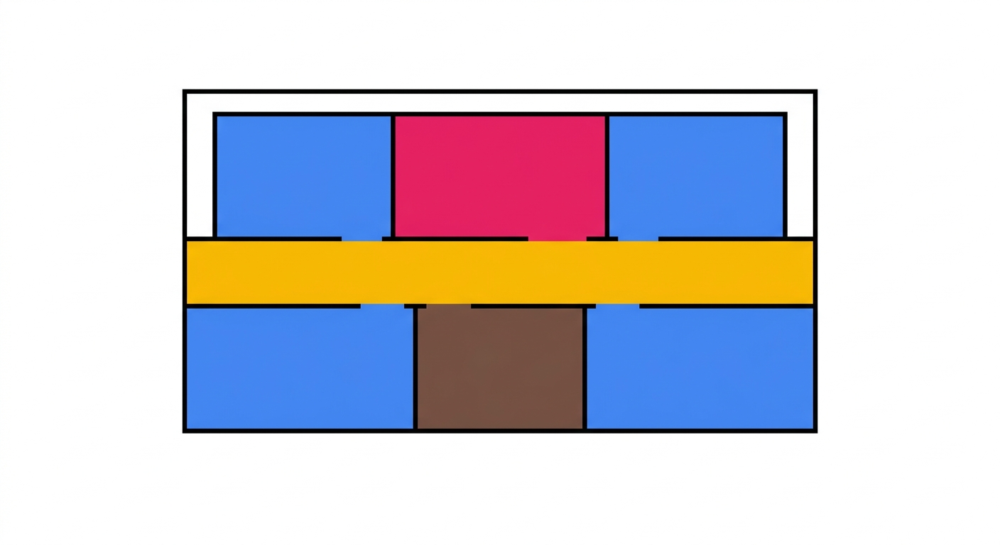 | 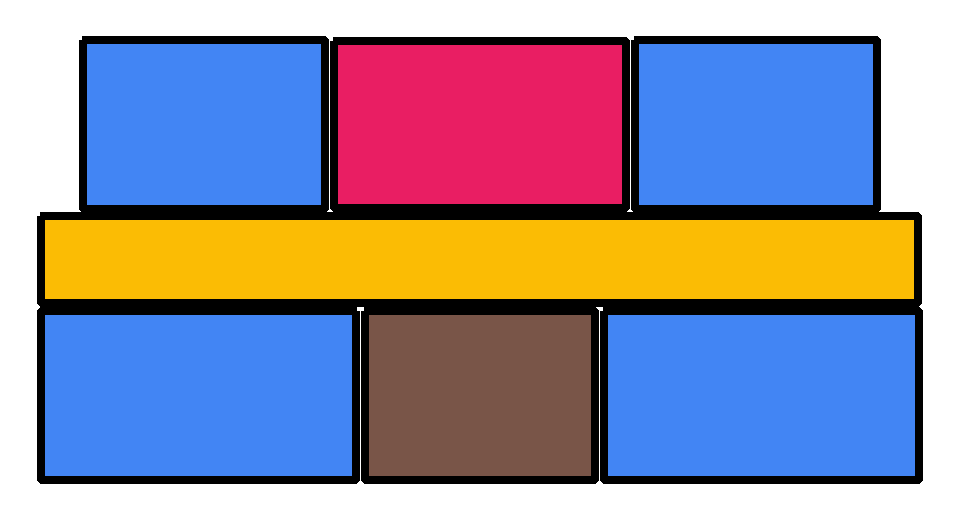 |

注意上图 Gemini 只画了 **4 间蓝色病房（要求 5）**——parser 没错，是 VLM 数错了。

它偶尔违规加文字标签（下图），但标签被 parser 的形态学清理化解，9 个房间照样全部解析正确：

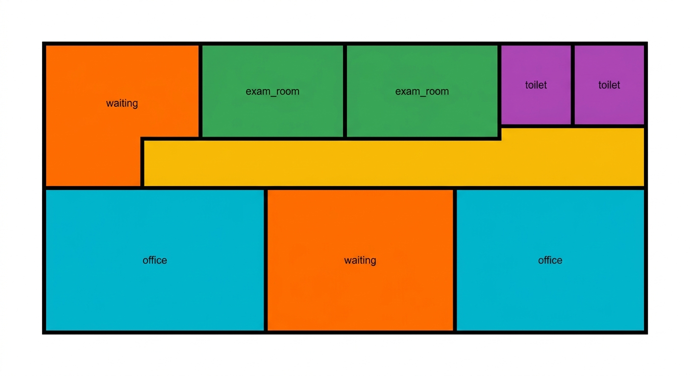

### ❌ 数量遵循：差且随机（单次生成 ~1/7 全对）

同一个 prompt 跑两次结果不同：clinic-small 第一次 6/6 全对，第二次要 3 间 exam_room 画了 5 间：

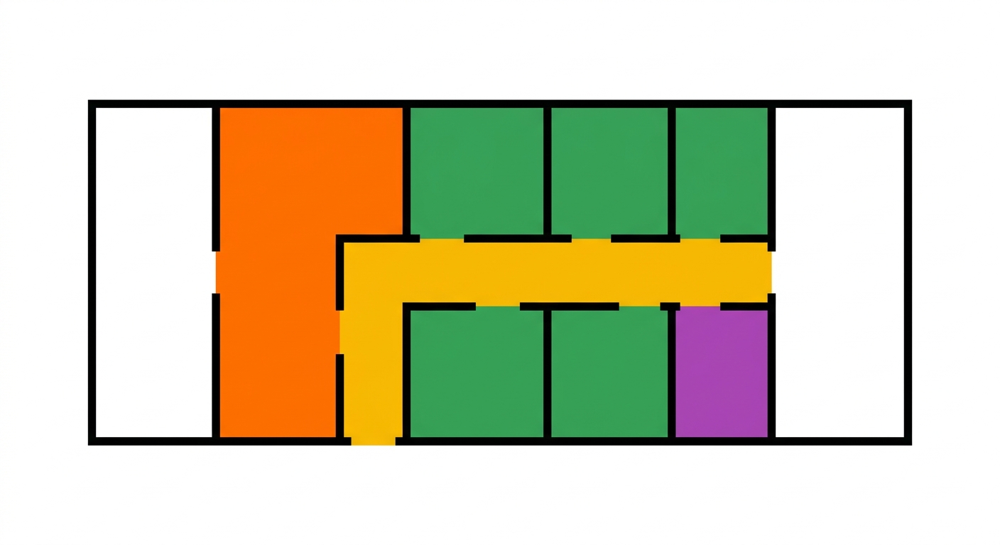

在 prompt 里加"COUNT CHECK 硬性清单 + 自查指令"**没有任何改善**（0/3）——图像模型精确计数是固有短板，prompt 修不了。

### ✅ 纠错循环：0/3 → 2/3（主路线成立）

实现（[`run_phase0a.evaluate_one`](../run_phase0a.py)）：`cv_parse` 当确定性验证器 → 输出量化违规（"patient_room: drew 4, required exactly 5"）→ 把**上一张图 + 违规清单**作为多模态输入喂回 Gemini 编辑 → 硬上限 3 轮 → 触顶返回**违规最少版**。

ward-wing 收敛实录——第 1 轮少画一间病房，第 2 轮编辑后 8/8 全对：

| 第 1 轮（patient_room 4/5 ❌） | 第 2 轮编辑后（8/8 ✅） |
|---|---|
| 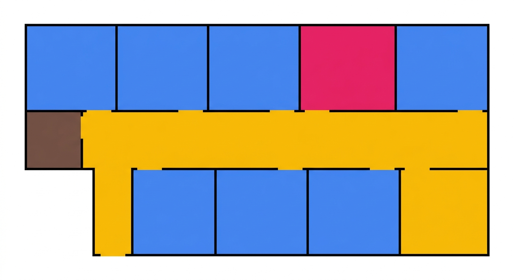 | 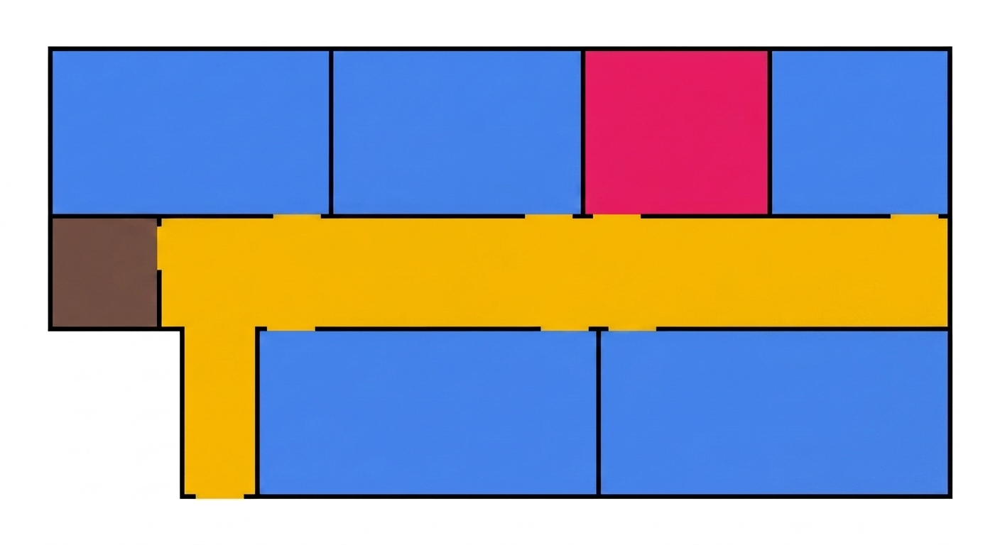 |

### ⚠️ 不收敛案例：违规数不单调下降（§5.3 预言命中）

clinic-mixed 的 toilet 翼被墙线切开（确定性计数 4 块而非 2），反馈后越改越多（4→6→6）：

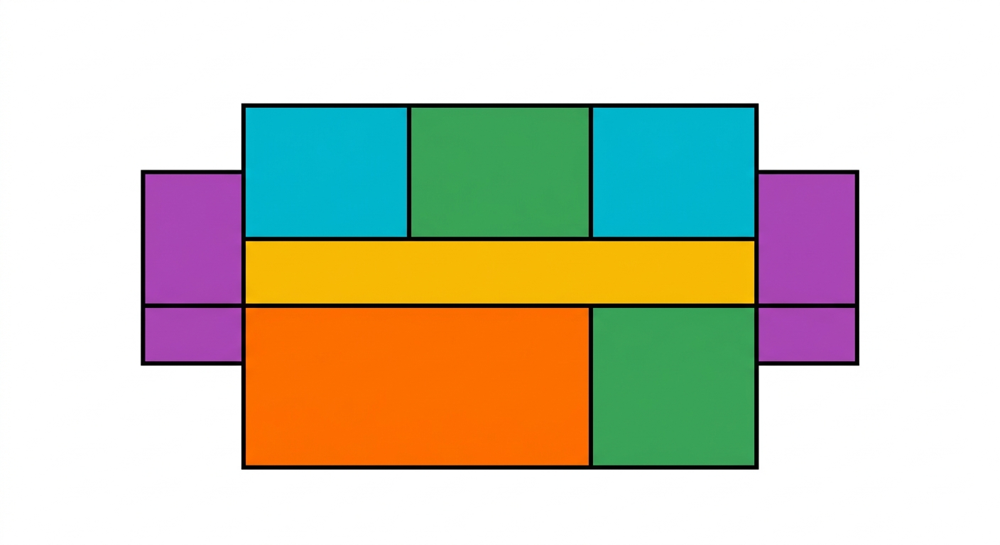

循环按纪律止损：3 轮触顶，返回违规最少的第 1 轮。这正是计划 §5.3"违规数不单调下降 → 止损/转人工"与"返回违规最少版"两条纪律的实测依据。

---

## 第三层：two-pass、parser 重写与确定性修复（后半程迭代）

### two-pass：先真实平面，再转色块（图像空间的 chain-of-thought）

直接要色块图，模型从"示意图"分布采样，布局呆板。改成 pass-1 先画**真实建筑平面**（要求标注房型文字），pass-2 在同一对话里把它转成无门窗、墙体闭合的色块图（按标签上色、删文字）：

| pass-1 真实平面（Gemini 自己画的） | pass-2 转换的色块图 |
|---|---|
| 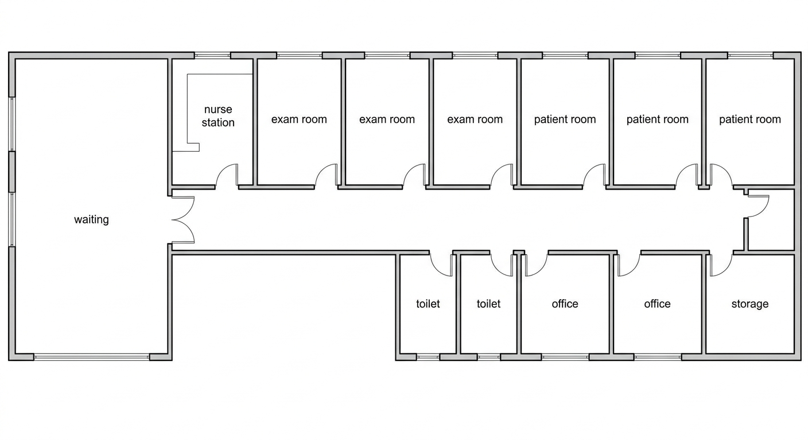 | 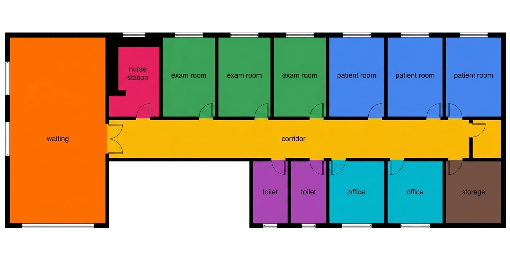 |

布局质量是质的飞跃（墙体填充、门弧、双卫并管井、L 形体量），转换逐间保真。两个教训：**pass-1 必须带房型标注**，否则 pass-2 只能瞎猜颜色；**转换时必须去掉门窗、封闭墙洞**，否则走廊色块被门洞切段、门弧切碎房间。

### parser 重写：构造性正交 + 全图轴线对齐

旧 parser（approxPolyDP + 局部正交化）的多边形有斜角毛刺、房间互不贴合。重写为：粗网格轮廓追踪（**构造上保证正交**）+ 全局 x/y 轴线聚类（**全图墙线共线**）+ 半墙厚膨胀（**消缝**）：

| 旧 parser（缝隙、毛刺、不对齐） | 新 parser（共墙、对齐、≤6 顶点/房） |
|---|---|
| 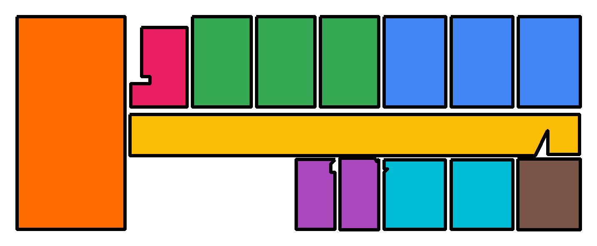 | 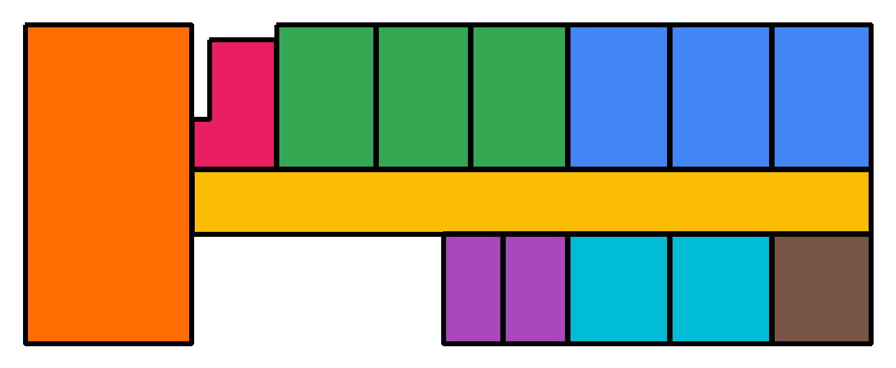 |

### 像素空间纠错在复杂度下雪崩 → 数量修复移入 JSON 空间

26 间房的 hospital-floor：首轮只差 2 间病房，但图像编辑纠错越改越糟（违规 1→2→5，第 2 轮甚至把整片诊室刷成病房色）。**数量是结构化约束，应该在结构空间修**——[`plan_fixes.fix_room_counts`](../tools/plan_fixes.py)：多了且有缺→重贴标签；多了→合并相邻同类；少了→分割最大同类。零 API 成本、必然终止、几何无损：

| hospital-floor 原图（26 间，少 2 病房） | 确定性修复后（split×2，全部精确） |
|---|---|
| 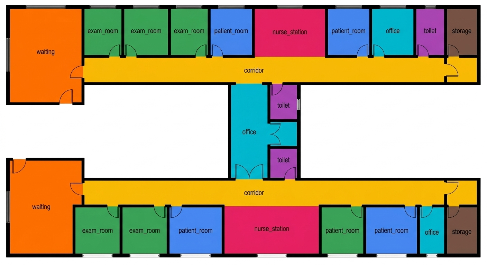 | 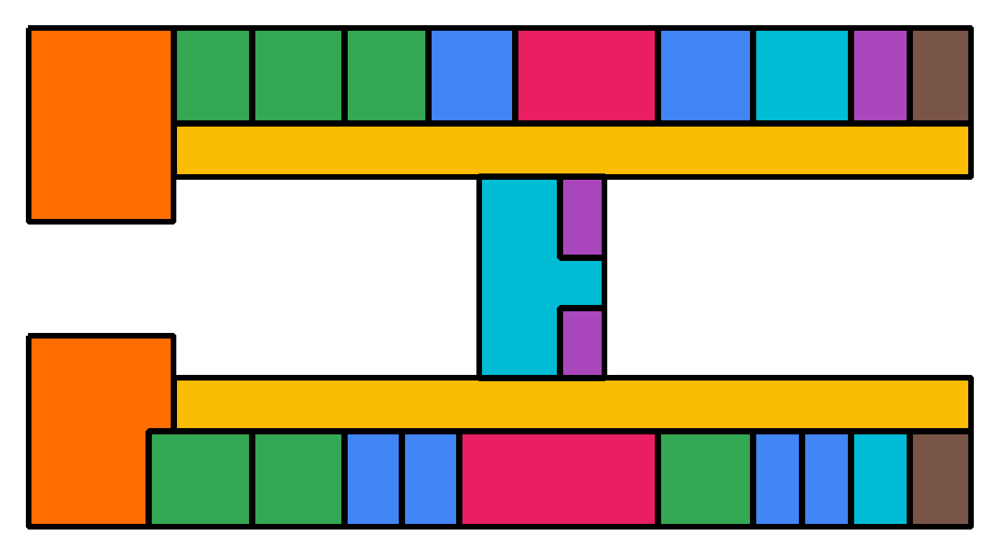 |

实测：clinic-small（多 1 诊室）`merge` 一步修复；hospital-floor（少 2 病房）`split×2` 修复。**5/5 program 最终数量全部精确。**

## 失败模式清单（全部已有对策）

1. **计数漂移**（要 3 画 5、要 5 画 4/7）→ 验证器循环 + JSON 空间 `fix_room_counts` 兜底。
2. **房间被门洞/墙线切碎** → 转换 prompt 去门窗封墙洞（已修）。
3. **纠错越改越糟**（编辑轮引入新违规，复杂图尤甚）→ best-round 纪律 + 数量类违规不再走像素编辑。
4. **pass-2 转换瞎猜房型** → pass-1 强制房型标注（已修）。
5. **多边形毛刺/缝隙** → parser 重写为构造性正交（已修）。

## 对后续 Phase 的输入

- **Phase 0-B（未做）**：mock VLM/CV，喂故意带违规的假平面，验证编排循环收敛性。
- **Phase 1**：三个 tool 直接作为 LangGraph 管线节点；纠错循环升级为子图节点，加 Reflexion 记忆防 4→6→6 式横跳。
- **门窗**：本轮未测——按计划 §11.2.1 走策略 C（规则推断），本就不依赖图像。
- **成本**：每张图 ~$0.13（1K/2K 档）；3 轮纠错上限下每 program ≤$0.4。

## 复现

```bash
hfagent/.venv/Scripts/python.exe -m pytest hfagent/tests -q     # 第一层（无需 API key）
hfagent/.venv/Scripts/python.exe -m hfagent.run_phase0a         # 第二层（需 GEMINI key）
```
